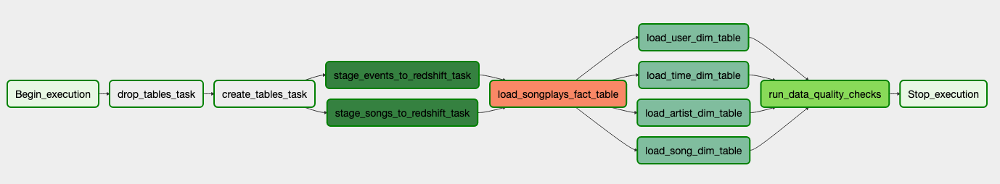

# Data Pipelines with Airflow

How can you automate and monitor data pipelines that support your analytical users?  One popular way is to use [Apache Airflow](https://airflow.apache.org/).  Describing complicated workflows as Directed Acyclic Graphs (DAGs), where each node is task directing the processing of the data.  The edges that connect the nodes order the sequence of tasks.  In this project, I:

1. Extract and load (EL) data from JSON files stored on [AWS S3](https://aws.amazon.com/s3/) into staging tables on [AWS Redshift](https://aws.amazon.com/redshift/). No transformations are made to the data during this step.

2. Extract, transform and load (ETL) the data from the staging tables into a set dimensional tables in AWS Redshift.

3. Data quality checks are performed on the dimensional tables to see if the transformations ran correctly.

Here is the DAG defining the sequence of these operations.



## Files


## Configuration

Here I am using my project's repository to store all my Airflow code and configuration files.  This folder is known as AIRFLOW_HOME and it is stored in the environment.  I set the AIRFLOW_HOME by running ```export AIRFLOW_HOME=`pwd`/airflow```.

## Helpful Airflow Commands

Aiflow has a command line interface ([CLI](https://airflow.apache.org/cli.html#)) that is very useful in finding issues with DAG objects.

* `airflow list_dags` - Lists all DAGS or produces a stack trace helping you find syntax problems.  

* `airflow test dag_id task_id execution_date` - Runs a task without running all tasks in the DAG.

* `airflow clear dag_id` - Clears the history of a partilar DAG from the database.

## References

1. [Airflow Documentation](https://airflow.apache.org/) - Airflows official documentation including a [Quick Start](https://airflow.apache.org/start.html) guide, [Tutorial](https://airflow.apache.org/tutorial.html) and the [Python API](https://airflow.apache.org/_api/index.html).  

1. [https://medium.com/datareply/airflow-lesser-known-tips-tricks-and-best-practises-cf4d4a90f8f](https://gtoonstra.github.io/etl-with-airflow/index.html) - Useful examples of how to best apply Airflow to ETL and ELT tasks.

1. [Airflow: Lesser Known Tips, Tricks, and Best Practises](https://medium.com/datareply/airflow-lesser-known-tips-tricks-and-best-practises-cf4d4a90f8f) - Describes features of Airflow that the author wished he had known sooner.

1. [Awesome Apache Airflow](https://github.com/jghoman/awesome-apache-airflow#awesome-apache-airflow-) - Currated list of Airflow resources.

1. [Can't import Airflow plugins](https://stackoverflow.com/questions/43907813/cant-import-airflow-plugins) - Stackoverflow post that discusses how to fix issues importing custom Airflow plugins.  

1. [Data’s Inferno: 7 Circles of Data Testing Hell with Airflow](https://medium.com/wbaa/datas-inferno-7-circles-of-data-testing-hell-with-airflow-cef4adff58d8) - How to maintain complex pipelines so you don't get called a 2 AM.  In a word, _testing_.

1. [Testing in Airflow Part 1 — DAG Validation Tests, DAG Definition Tests and Unit Tests](https://blog.usejournal.com/testing-in-airflow-part-1-dag-validation-tests-dag-definition-tests-and-unit-tests-2aa94970570c) - Seriously, testing Airflow seems highly worthwhile.